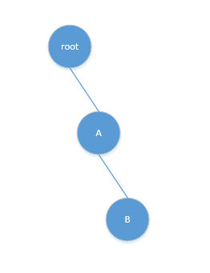
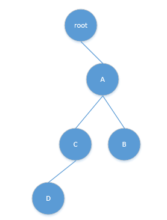

# Python logging 模块

> 给大家剖析下Python的logging模块。

logging模块是Python内置的一个强大易用的日志模块。简单到你只需要两行代码就能输出一些东西来：

```python
import logging
logging.warning('Hi, I print something.')
```

输出：

```console
WARNING:root:Hi, I print something.
```

当然，我们可不能满足于此，你也很容易发现把上面 `warning` 改成 `info` 就输不出来了。别急，往下看。

## 1. 先大体概括下logging的结构

- 整体上来说，日志管理最大的结构是Manager，Manager管理所有的Logger，但你不用去管这个东西，它是藏在背后默默干活的。
- Logger里最根部是一个RootLogger，name是root，其他所有Logger都是在这个Logger下，通过名字，形成父子、子孙的树杈结构。
- Logger里面有一些东西，Filter、Handler、LogRecord、Formatter，可以看作是一些配置，各自有各自的作用，接下来会介绍。
- 还能用LoggerAdapter对Logger进行一定的包装，一般我们用的很少。

logger是一个树结构，默认有个根root，其他logger都是其上的枝桠，比如创建一个name='A.B'的logger，其实际结构就是 root-A-B



再创建一个name='A.C.D'的logger，结构变为：




## 2. level —— 输出哪个级别的日志

在输出log的时候，不能所有日志都输出出来，而是有所选择，比如有时候我们只希望看到warning以上严重程度的，如果有太多info、debug会让log可读性变得很差。

我们可以通过设置logger的level来实现这一点。在logging中，将level设置如下：

| LevelName | LevelValue |
| :--: | :--: |
| CRITICAL/ FATAL | 50 |
| ERROR | 40 |
| WARNING/ ~~WARN~~ | 30 |
| INFO | 20 |
| DEBUG | 10 |
| NOTSET | 0 |


```python
import logging
logger = logging.getLogger('test')
logging.basicConfig()  # basicConfig是logging提供的简单的配置方法，不用basicConfig则需要手动添加handler
logger.setLevel(logging.INFO)  # 输出所有大于等于INFO级别的log
logger.info('I am <info> message.')
logger.debug('I am <debug> message.')  # 不输出
```

结果正如所料，info输出，debug未输出。

```log
INFO:test:I am <info> message.
```

要注意的是： **root 的默认级别是 WARNING！**， 而且logger实际输出时的level是取决于EffectiveLevel，即从该级往上走，遇到的第一个level不为0的logger的level，也就是说如果你创建了logger，而没有为其设置level，那它默认是NOTSET，程序会往上层找，直到root，而root级别是WARNING，所以可能会导致没有输出日志。

## 3. handler —— 输出到哪里

我们写日志一个很重要的问题就是把日志输出到什么地方去，我们可能希望某些日志在console打印出来，可能希望有更详细的日志输出到log文件里去。怎么控制这些输出就需要用handler了。

```python
import logging
logger = logging.getLogger('test')
logger.addHandler(logging.StreamHandler())  # 添加StreamHandler
logger.setLevel(logging.INFO)  # 输出所有大于INFO级别的log
logger.info('I am <info> message.')
logger.debug('I am <debug> message.')  # 不输出
```

我们把上面的例子稍微改动了一下，可以看到输出如下，输出到了console里

```log
I am <info> message.
```

这就是logging提供的最基本的一个handler，其他各种handler都是从这个handler继承发展来的。理论上可以把日志输出到各种流中，stderr、文件、socket等都可以。当然logging已经将各种流handler封装好了。

如：

```python
import logging
logger = logging.getLogger('test')
logger.addHandler(logging.StreamHandler())
logger.addHandler(logging.FileHandler('test.log'))  # 再添一个FileHandler
logger.setLevel(logging.INFO)  # 输出所有大于INFO级别的log
logger.info('I am <info> message.')
logger.debug('I am <debug> message.')  # 不输出
```

可以看到，info不仅仅输出到了console中，还在当前文件夹下创建了一个test.log文件并输出到了该文件中。在logging.handlers中还封装了一堆更高级的handlers，可以了解下，尤其是RotatingFileHandler和TimedRotatingFileHandler，可以把你的日志按一定规则分割成多份。你也可以自己封装handler哦，网上有人这么干的。

上面我们看到了logger的级别，可以控制这个logger要输出什么级别的log。但这里我们发现可以在logger里添加handler，控制输出log到哪里，明显发现，其实我们想要在不同的handler里输出不同级别的日志。

比如我们想要在console里输出warning以上的日志，在log文件里输出debug以上的日志，该怎么办呢？

**handler也是有级别的。**

如下：

```python
import logging
logger = logging.getLogger('test')
logger.setLevel(logging.INFO)  # 输出所有大于INFO级别的log

# 添加StreamHandler，并设置级别为WARNING
stream_hdl = logging.StreamHandler()
stream_hdl.setLevel(logging.WARNING)
logger.addHandler(stream_hdl)
# 添加FileHandler，并设置级别为DEBUG
file_hdl = logging.FileHandler('test.log')
file_hdl.setLevel(logging.DEBUG)
logger.addHandler(file_hdl)

logger.info('I am <info> message.')
logger.debug('I am <debug> message.')  # 不输出
````

设置了WARNING级别的StreamHandler以及DEBUG级别的FileHandler。在logger.info()执行时，程序判断log级别（info） >= logger级别（INFO），可以输出。

然后程序判断log级别（info） < StreamHandler级别（WARNING），不在stderr输出；同时log级别（info） > FileHandler级别（DEBUG），在test.log中输出。

而logger.debug()的级别 < logger级别（INFO），所以不会在stderr和test.log输出。

其实上面的程序有个问题，就是设置了logger是INFO，那么FileHandler是DEBUG没有什么意义的，DEBUG级别的日志过不了logger那关。

你在写代码的时候就需要注意了，要给logger添加handler，并且注意logger和handler的level，否则可能会输不出你想要的log哦。

## 4. formatter —— 输出日志的格式

细心的话可以发现，我们后来自己添加的handler输出的log是没有格式的，就仅仅是输出而已。但basicConfig()输出的log是有格式的（虽然很丑）。

不同在于basicConfig()中的handler是带有formatter的。我们要添加formatter就需要用到logging中的另一个类Formatter

```python
import logging
logger = logging.getLogger('test')
logger.setLevel(logging.INFO)  # 输出所有大于INFO级别的log
fmt = logging.Formatter('%(name)s - %(levelname)s - %(asctime)s - %(message)s')
# 添加StreamHandler，并设置级别为WARNING
stream_hdl = logging.StreamHandler()
stream_hdl.setLevel(logging.WARNING)
stream_hdl.setFormatter(fmt)
logger.addHandler(stream_hdl)
# 添加FileHandler，并设置级别为DEBUG
file_hdl = logging.FileHandler('test.log')
file_hdl.setLevel(logging.DEBUG)
file_hdl.setFormatter(fmt)
logger.addHandler(file_hdl)

logger.info('I am <info> message.')
logger.debug('I am <debug> message.')  # 不输出
```

如上例中，我们添加了formatter，格式为 `(logger name) - (level name) - (当前时间) - (日志信息)`，输出的结果为：

```log
test - INFO - 2017-09-06 16:45:36,977 - I am <info> message.
```

是不是漂亮多了，logging的formatter可以输出的不止这几个信息，还有很多：

- %(name)s            ——Name of the logger (logging channel)
- %(levelno)s         ——Numeric logging level for the message (DEBUG, INFO, WARNING, ERROR, CRITICAL)
- %(levelname)s       ——Text logging level for the message ("DEBUG", "INFO", "WARNING", "ERROR", "CRITICAL")
- %(pathname)s        ——Full pathname of the source file where the logging call was issued (if available)
- %(filename)s        ——Filename portion of pathname
- %(module)s          ——Module (name portion of filename)
- %(lineno)d          ——Source line number where the logging call was issued(if available)
- %(funcName)s        ——Function name
- %(created)f         ——Time when the LogRecord was created (time.time() return value)
- %(asctime)s         ——Textual time when the LogRecord was created
- %(msecs)d           ——Millisecond portion of the creation time
- %(relativeCreated)d ——Time in milliseconds when the LogRecord was created, relative to the time the logging module was loaded(typically at application startup time)
- %(thread)d          ——Thread ID (if available)
- %(threadName)s      ——Thread name (if available)
- %(process)d         ——Process ID (if available)
- %(message)s         ——The result of record.getMessage(), computed just as the record is emitted

我们也可以给Formatter传入第二个参数，修改日期格式，比如 `%Y-%m-%d` ，则输出的log就没有时分秒了。

这样就可以定制log的格式了，还可以为不同的handler制定不同的formatter，以适应不同情况下的阅读或传输需求。

## 5. Filter和LoggerAdapter

最后这里有两个我们不常用到的东西，懒得多写了。


## 6. 重复写日志的问题

这里有一个坑需要特别说明下，就是add handler的问题。一个logger创建之后不要重复添加handler，有时候我们多个文件都调用我们封装好的logger的类，就有可能会发生重复添加handler的情况，具体的看博主这篇文章——[python logging 重复写日志问题](http://blog.csdn.net/huilan_same/article/details/51858817)

## 7. 差点忘了

差点忘了配置的问题，我们可以通过多种途径配置logger，像上面用过的basicConfig()（没有用参数，可以自己阅读源码，很简单的几个参数），或者像上面的例子手动添加handler、设置formatter，logging还给了我们其他高级的配置方法：

logging.config里有多种配置方法，像fileConfig，可以直接读一个文件；像dictConfig，可以传一个dict进行配置（django就是这么配置的）；似乎还能起个socket，来实时修改config，听起来很吊的样子。

不过我们用其中的一种就可以了，随便配喽。

比如，像博主这样 [怎样从0开始搭建一个测试框架_2](http://blog.csdn.net/huilan_same/article/details/76572446)

就说这些，跟其他人的讲法好像不太一样，结合着来看吧。

> 有什么好的建议或者问题，可以留言或者加我的[QQ群:455478219](https://jq.qq.com/?_wv=1027&k=4EQQKFg)讨论。